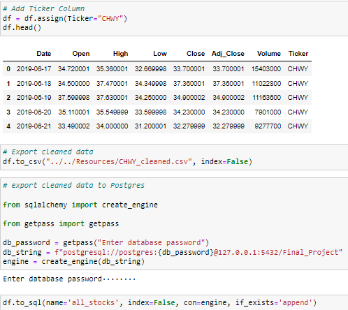
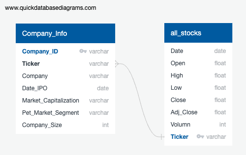
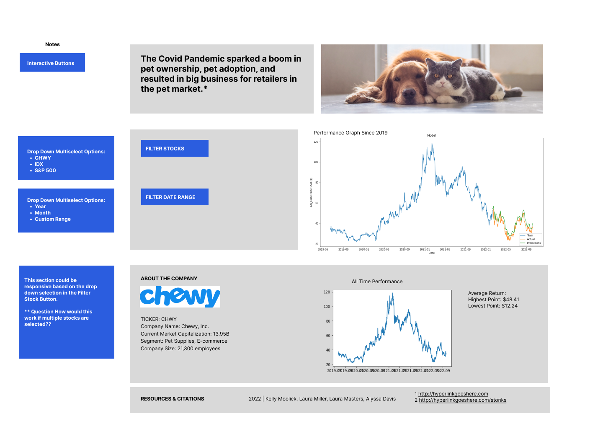

# Final_Project

## Overview

In 2019 the Covid-19 pandemic spread worldwide. In attempt to minimize the spread of the virus, the USA went in to lockdown in March of 2020. Many Americans adopted pets, largely cats and dogs, to cope with the stress of being hope for such a long period of time during lockdown. How has this affected the stock market for large pet companies? We are looking at stock closing price data for multiple pet companies across 2019-2020 to determine how Covid-19 impacted this industry.  Our hypothesis is that the changes associated with working from home and mandatory closures corresponded to an increase in pet ownership and this would be reflected in the stock data as an increase in stock pricing when compared to previous years.  We selected stocks to show various sectors of this industry including veterinary services, pet food and treats, pet care products, online pet medication and supplements and veterinary diagnostic services. 

Goal: To develop a ML model to predict stock performance for this business sector and demonstrate how this industry thrived across this time period.

### Selected Stocks
- Chewy (CHWY) - an independent subsidiary of PetSmart, Chewy.com is an online retailer offering food, supplements, prescriptions and supplies
- Trupanion Inc (TRUP) - a medical insurance provider for dogs and cats
- Freshpet Inc (FRPT) - a pet food manufacturer, specializes in refrigerated meals and treats for dogs and cats which are distributed by local retailers and specialty pet stores
- PetIQ Inc (PETQ) - operates a products segment (manufacture and distribution of health and wellness products) and services segment (veterinary health clincs and wellness centers) 

## Presentation Slides
Here is a link to the draft presentation [slides](https://docs.google.com/presentation/d/1QxTAxMEOH4uQNyeQjTgOWfsjggnLrtuQdbM-eKRpzdk/).

## Communication Protocols
- biweekly video calls 
- google shared drive 
- Git repository
- dedicated Slack channel

## Project Flow

## Data Sources
Yahoo Finance Historical Data : CHWY, ELAN, FRPT, PETQ, ^SPX

Historical data for each stock and the S&P 500 Index was downloaded as individual `.csv` files from Yahoo Finance.  Each file was read into a pandas dataframe and checked for datatype and null values.  The date was converted to datetime and a column was added to each dataframe to identify the stock's ticker, which would become the primary key for the database. Each cleaned dataframe was exported as a .csv file for the repository and also loaded to a Postgres Table `all_stocks` using SQLALchemy.  

Pet Ownership and Industry data
- Insurance Information Institute
- American Pet Products Association
- American Veterinary Meidcal Association
- North American Pet Health Insurance Association

## Database

Entity Relationship Diagram (ERD)

Using PGadmin, the `all_stocks` table was joined with the `company_info` table and exported as a `all_stocks_joined.csv` for the machine learning segment.

## Visualizations
The final project dashboard was built in Tableau and hosted on Tablea Public. [Link to Tableau Dashboard](https://public.tableau.com/app/profile/alyssa.davis/viz/Dashboard_D01/DashboardD03)

The dashboard has three sections:
- Header with project background and image
- Company Info / Filters
- Machine Learning Predictions and RMSE scores

The user can view all company data or filter down to a specific stock and date range.

Diagramming the mockup in Figma before creation helped us identify what data points to show and what elements we wanted to be interactive. Below is the  draft mockup of our final dashboard presentation. The interactive elements as noted in the mockup to filter to specific stocks and date ranges to learn more.

## Machine Learning

Our first Machine Learning Model was built using a basic Neural Network. 
We started off by importing our dependencies and reading in our cleaned Chewy data to produce a Chewy DataFrame as shown in the image below.

We then generated our DataFrame and reviewed our columns, at this point we realized we had an issue with the name of one of the columns, so we amended the name by using the .rename function to rename our Adj_Close column.  We began setting up our model by listing the X and y values, calling the X values chewy_df[["Open", "High", "Low", "Close", "Volume"]] and the y value chewy_df["Adj_Close"]. 

We then imported sklearn.model_selection and train_test_split to set up our data for splitting.  

Our next step was to then scale the data to set it up for the keras sequential model.  After setting up the keras sequential model, we added our first 
dense layer and output layer.  We then compiled the data and fit the model to the training data.  The end result provided us with a model that was not very
accurate for what we were trying to predict, so we decided to take what we learned from this model and move on to creating a more reliable model which was our LSTM model. 

#### Data preprocessing:
To preprocess the data, we began by checking the data types. We then converted the date into a datetime format. The data was checked for null values, any of which were removed. This analysis does not require extensive preprocessing to run with the LSTM model.

#### Feature selection and engineering:
Date and Adjusted Close price (Adj_Close) were chosen as the features for this model to best portray the predictions for each stock. The adjusted close price was chosen over the close price because the adjusted close is a more accurate representation of the stock’s value. The close price only reflects the cost of the shares at the end of the day. Adjusted close accounts for other things such as dividends, stock splits, and new stock offerings.  scaled the data to normalize the data in a 0 to 1 range. Then converted the data into a Numpy array before reshaping the data to fit the 3D model.

#### Training and testing sets:
The adjusted closing price was extracted into a new dataframe, then converted into a time series. 80% of the data was then split into the training set and the remaining 20% into the testing set.  Data was group by 60-day segments to train the model. The data was then converted in to a Numpy array which is the format accepted by Tensorflow for training, then reshaped into a three-dimensional array to work with the LSTM model. The remaining 20% of normalized data was processed for the testing sets in a similar fashion as the training sets
*Insert the picture of the training portion here*

#### Why LSTM; Benefits and Limitations:
For this project, an LSTM model was necessary to perform this analysis. It is difficult to train RNNS to capture long-term dependencies because the gradients tend to either vanish or explode. This is referred to as the vanishing gradient problem, where the gradient shrinks the further back in time it goes. Too small a gradient won’t allow for good machine learning. Due to this, a normal RNN was excluded after the first analysis attempt.
Instead, a Long Short-Term Memory (LSTM) was chosen for this model because unlike other recurrent neural networks, the LSTM model has a large memory capacity and is able to store past information.  LSTM is one type of RNN used to learn order dependence in sequence predictions. Unlike traditional RNN’s, the LSTM model has gates that control the flow of information. An LSTM model has the capability to learn which data is or is not important within the sequence. These models are great for stock predictions because the future of a stock price is dependent on the price history. 
There are a few potential draw backs of using the LSTM model. The main drawbacks for this model are;
*The training process is longer
*They require more memory to train (cannot be done in cloud due to scaling)
*Prone to overfitting

#### Model Choice:
The original model choice was a normal RNN until we realized we were working with Timeseries data and that a standard RNN would be unable to retain enough information to properly train the model. We then chose an LSTM instead as this is the most common practice for stock prediction. The stock history data for all four stockers were concatenated into one database. Tickers were implements to allowed for filter based on that ticker - CHWY, ELAN, FRPT, PETQ.

#### Model training:
The model was trained by fitting it to the previously separated testing set data. To do this, an optimizer and loss function was applied.
* Insert picture HERE *

For this project, the “adam” optimizer for its fast results and works well with large datasets. The model was then fit to training sets using a batch_size of 1 and run for 5 epochs.

#### Description of current accuracy score:

The LSTM model uses a root mean square error (RMSE) metric to determine the accuracy and performance of the model. The close to 0 that the RMSE score is, the more accurate the model is performing. When running the RMSE for this model, our team ended with a score of 1.0159546093459928, which indicated that the model is performing well. 

## Summary

## Future Improvement

Since many of the pet stock sources were private, the data was limited to the ones that were available to the public through Yahoo! Finance. Due to this issue, some of the major pet companies such as PetCo and PetSmart were unable to be added to the analysis. These are multibillion-dollar companies that dominate the pet industry. If the stock information for these companies were added to the analysis, we would have a more accurate depiction of how well the pet industry did in the stock market in 2019. 

## References

ASPCA - https://www.aspca.org/about-us/press-releases/new-aspca-survey-shows-overwhelming-majority-dogs-and-cats-acquired-during

Washington Post - https://www.washingtonpost.com/business/2022/01/07/covid-dogs-return-to-work/

US News - https://money.usnews.com/investing/stock-market-news/slideshows/pet-stocks-to-buy-amid-the-boom-in-ownership?slide=2

Yahoo Finance - https://finance.yahoo.com/news/9-best-purebred-pet-stocks-210145250.html

